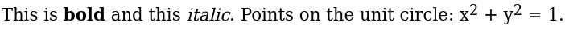
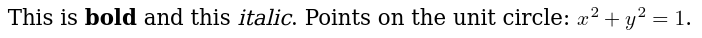
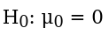
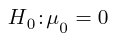

## TeX-to-HTML/MathML Translators

The R package `tth` provides an R interface to the TeX-to-HTML/MathML
translators `tth` and `ttm` written in C by Ian H. Hutchinson
(see <http://silas.psfc.mit.edu/tth/>).

```
library("tth")
tex <- c("This is \\textbf{bold} and this \\textit{italic}.",
  "Points on the unit circle: $x^2 + y^2 = 1$.")
tth(tex)
## [1] "This is <b>bold</b> and this <i>italic</i>."                  
## [2] "Points on the unit circle: x<sup>2</sup> + y<sup>2</sup> = 1."
```



```
ttm(tex)
## [1] "This is <b>bold</b> and this <i>italic</i>."                                   
## [2] "Points on the unit circle: <math xmlns=\"http://www.w3.org/1998/Math/MathML\">"
## [3] "<mrow>"                                                                        
## [4] "<msup><mrow><mi>x</mi></mrow><mrow><mn>2</mn></mrow>"                          
## [5] "</msup>"                                                                       
## [6] "<mo>+</mo>"                                                                    
## [7] "<msup><mrow><mi>y</mi></mrow><mrow><mn>2</mn></mrow>"                          
## [8] "</msup>"                                                                       
## [9] "<mo>=</mo><mn>1</mn></mrow></math>."                                           
```



```
h0 <- "$H_0: \\mu_0 = 0$"
tth(h0)
## [1] "H<sub>0</sub>: &#956;<sub>0</sub> = 0"
tth(h0, mode = "hex")
## [1] "H<sub>0</sub>: &#x03BC;<sub>0</sub> = 0"
tth(h0, mode = "named")
## [1] "H<sub>0</sub>: &mgr;<sub>0</sub> = 0"
```



```
ttm(h0)
## [1] "<math xmlns=\"http://www.w3.org/1998/Math/MathML\">"                           
## [2] "<mrow>"                                                                        
## [3] "<msub><mrow><mi>H</mi></mrow><mrow><mn>0</mn></mrow>"                          
## [4] "</msub>"                                                                       
## [5] "<mo>:</mo>"                                                                    
## [6] "<msub><mrow><mi mathvariant=\"italic\">&mu;</mi></mrow><mrow><mn>0</mn></mrow>"
## [7] "</msub>"                                                                       
## [8] "<mo>=</mo><mn>0</mn></mrow></math>"
```




## C source code

The C source code for `tth` and `ttm` has been taken from the testing line
of the Debian Linux distribution which distributes the code under the
GPL version 2. The C source has been created using the flex parser
generator (by running make after unpacking the sources). The flex
sources are not distributed with this R package. A full set of sources
including documentation can be obtained from any Debian mirror, e.g.,

<https://ftp.debian.org/debian/pool/main/t/tth/>
       
Each version which is distributed as part of the R package is also
available at

<https://www.R-exams.org/tth-src/>

as original sources, Debian patches and Debian patched version (the
latter is used in the R package).
